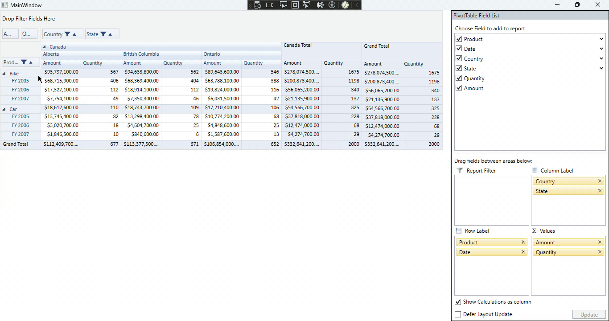

# How to preserve resized Width and Height after schema designer changes in WPF PivotGridControl?
In the [WPF PivotGridControl](https://help.syncfusion.com/wpf/pivotgrid/overview), users can manually resize columns and rows when **AllowResizeColumns** and  **AllowResizeRows** are enabled. However, modifying fields via the [PivotSchemaDesigner](https://help.syncfusion.com/wpf/pivot-grid/pivotschemadesigner-for-wpf) causes the PivotGridControl to recalculate its layout and reset column widths and row heights to their default values.
 
To retain customized dimensions across schema modifications:
1. Set AutoSizeOption="None" on PivotGridControl to disable automatic cell resizing.
2. Hook the ResizingColumns and ResizingRows events on PivotGridControl.InternalGrid to track user-resized dimensions in dictionaries keyed by row or column index.
3. Listen to the PivotEngine.PivotSchemaChanged event.
4. Reapply stored column widths and row heights asynchronously using Dispatcher.BeginInvoke with DispatcherPriority.Loaded after the control completes its layout recalculation.
 
**Note:** This approach is applicable to all **GridLayout** modes. It is also useful for similar scenarios where the values are reset, such as during **group expand/collapse** operations. In such cases, you can handle the corresponding events and restore the values within those event handlers.
 
**Please refer to the code snippet below:**
 
```csharp
public partial class MainWindow : Window
{
    // Store user-customized column widths by FieldMappingName or Column Key
    private readonly Dictionary<int, double> _customColumnWidths = new Dictionary<int, double>();
    private readonly Dictionary<int, double> _customRowHeights = new Dictionary<int, double>();
    public MainWindow()
    {
        InitializeComponent();
        pivotGrid.GridLayout = GridLayout.ExcelLikeLayout;
        pivotGrid.Loaded += pivotGrid_Loaded;
    }
 
    private void pivotGrid_Loaded(object sender, RoutedEventArgs e)
    {
        if (pivotGrid.InternalGrid != null)
        {
            pivotGrid.InternalGrid.ResizingColumns += InternalGrid_ResizingColumns;
 
            pivotGrid.InternalGrid.ResizingRows += InternalGrid_ResizingRows;
        }
 
        pivotGrid.PivotEngine.PivotSchemaChanged += PivotEngine_PivotSchemaChanged;
    }
 
    private void InternalGrid_ResizingColumns(object sender, GridResizingColumnsEventArgs args)
    {
        if (args.Reason == Syncfusion.Windows.Controls.Grid.GridResizeCellsReason.MouseUp)
        {
            for (int c = args.Columns.Left; c <= args.Columns.Right; c++)
            {
                _customColumnWidths[c] = args.Width;
            }
        }
    }
 
    private void InternalGrid_ResizingRows(object sender, GridResizingRowsEventArgs args)
    {
        if (args.Reason == Syncfusion.Windows.Controls.Grid.GridResizeCellsReason.MouseUp)
        {
            for (int r = args.Rows.Top; r <= args.Rows.Bottom; r++)
            {
                _customRowHeights[r] = args.Height;
            }
        }
    }
 
    private void PivotEngine_PivotSchemaChanged(object sender, Syncfusion.PivotAnalysis.Base.PivotSchemaChangedArgs e)
    {
        // Defer restoration until after the grid finishes its internal layout & ExcelLikeLayout reset
        Dispatcher.BeginInvoke(new Action(() =>         {             RestoreGridDimensions();         }), System.Windows.Threading.DispatcherPriority.Loaded);
    }
 
    private void RestoreGridDimensions()
    {
        if (pivotGrid.InternalGrid == null || pivotGrid.InternalGrid.Model == null)
            return;
 
        // Restore Column Widths
        foreach (var entry in _customColumnWidths)
        {
            if (entry.Key < pivotGrid.InternalGrid.Model.ColumnCount)
            {
                pivotGrid.InternalGrid.Model.ColumnWidths[entry.Key] = entry.Value;
            }
        }
 
        // Restore Row Heights
        foreach (var entry in _customRowHeights)
        {
            if (entry.Key < pivotGrid.InternalGrid.Model.RowCount)
            {
                pivotGrid.InternalGrid.Model.RowHeights[entry.Key] = entry.Value;
            }
        }
 
        pivotGrid.InternalGrid.InvalidateVisual();
    }
} 
```
 
 
**Output:**
 

 
Take a moment to review the [WPF PivotGrid - Resizing](https://help.syncfusion.com/wpf/pivot-grid/how-to/resizing-columns-and-rows-in-pivotgrid) documentation, to learn more about resizing rows and columns.